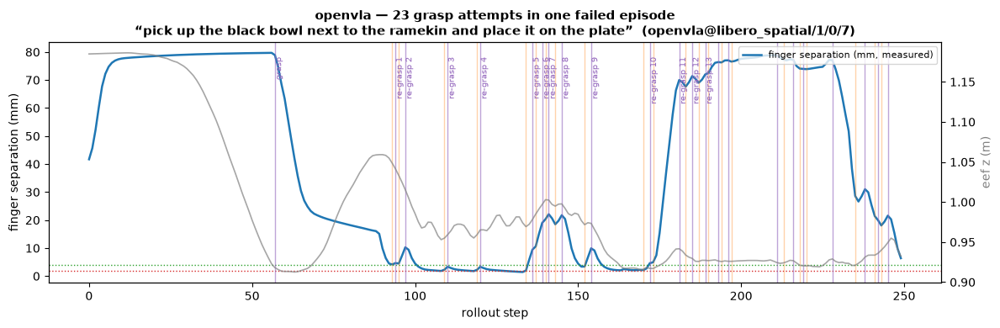

# vla_jepa_harness

A modern, unified Python environment for running robotics model benchmarks across VLA, JEPA,
LIBERO, MuJoCo, and robosuite — with **queryable failure forensics** over every rollout.

Many academic robotics repositories ship with strict dependency pins and isolated environment
assumptions. After testing the dependency requirements across several fragmented
implementations, we found that many of these constraints were not fundamental. They could be
resolved with standard engineering practices, modern Python tooling, and careful compatibility
fixes. The aim is not only reproducibility, but **operational reproducibility**: the ability
to run, modify, compare, scale, and extend research systems the way real engineering teams
work.

## The result

VLA-JEPA and OpenVLA on LIBERO-Spatial (10 tasks × 10 trials, seed 7, 200 episodes, A100s):

|             | success rate | failures | failure mix              |
|-------------|--------------|----------|--------------------------|
| VLA-JEPA    | **99/100**   | 1        | 1 re-grasp               |
| OpenVLA     | **84/100** — within a point of the published 84.7% | 16 | **15 re-grasp** + 1 no-grasp |

Every rollout streams to a one-row-per-step parquet schema, so "the success rate dropped"
decomposes into *policy* failures vs *harness* failures with a DataFrame query instead of an
afternoon of scrubbing video. [Read the full write-up →](BLOG_POST.md)



## One command (after Modal setup)

```bash
pip install -e ".[dev,modal]"
modal token new                                   # authenticate (once)
modal secret create hf-token HF_TOKEN=<your-hf-token>   # once; volumes auto-create

modal run harness/rollout/modal_vla_jepa_app.py --suites libero_spatial --episodes 10
```

That single command builds the verified image (Python 3.12, one resolver pass), pulls the
checkpoint, runs the episodes on an A100, and writes schema-exact parquet to a shared volume.
OpenVLA runs the same way via `harness/rollout/modal_app.py --policy-type openvla`.

## Where to go

- **[The write-up](BLOG_POST.md)** — the full story: the 0% that wasn't, the comparison, the
  field guide.
- **[Evaluation patterns](EVAL_PATTERNS.md)** — the nine-component grammar every VLA eval
  shares, the model × benchmark matrix, and the community lexicon.
- **[Friction points](FRICTION_POINTS.md)** — 19 landmines between you and a reproducible VLA
  eval, symptom → fix.
- **[Friction log](FRICTION_LOG.md)** — everything we hit, in the order we hit it, with
  commits as receipts.
- **[The repo](https://github.com/Eventual-Inc/VLA-JEPA)** — code, tests, notebook, NOTES.

Built by [Eventual](https://eventual.ai) — the team behind [Daft](https://daft.ai) — as part
of our physical-AI data tooling. Sibling project:
[daft-physical-ai](https://github.com/Eventual-Inc/daft-physical-ai).
