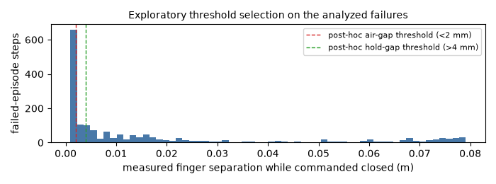
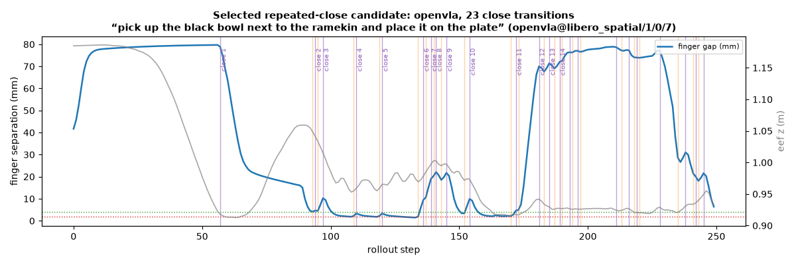
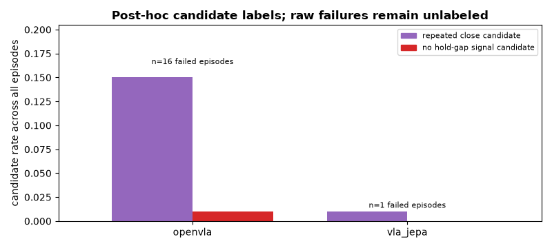

# physical-ai-evals

`physical-ai-evals` is a research-oriented harness for running VLA policies on LIBERO and
retaining queryable, one-row-per-step trajectories. It currently includes OpenVLA and
VLA-JEPA adapters, separate Modal environments for their incompatible dependency stacks, a
normalized Parquet schema, and an exploratory paired pilot.

## What the pilot establishes

The artifact labeled `2026-07-02` contains 200 episodes and 23,283 step rows: 100 fixed
LIBERO-Spatial episode specifications for each policy (10 tasks × initial-state indices 0–9).
The label is an artifact identifier, not a recorded execution timestamp. The episode
specifications are paired across policies.

| Policy | Successes | Rate | Descriptive 95% Wilson interval |
|---|---:|---:|---:|
| VLA-JEPA | 99/100 | 99% | 94.6%–99.8% |
| OpenVLA | 84/100 | 84% | 75.6%–89.9% |

Paired outcomes: 84 specifications succeeded under both policies, 15 under VLA-JEPA only,
none under OpenVLA only, and one failed under both.

| Task id | VLA-JEPA successes | OpenVLA successes |
|---:|---:|---:|
| 0 | 10/10 | 10/10 |
| 1 | 10/10 | 8/10 |
| 2 | 10/10 | 9/10 |
| 3 | 10/10 | 9/10 |
| 4 | 10/10 | 7/10 |
| 5 | 9/10 | 6/10 |
| 6 | 10/10 | 9/10 |
| 7 | 10/10 | 10/10 |
| 8 | 10/10 | 7/10 |
| 9 | 10/10 | 9/10 |

The Wilson intervals assume independent and identically distributed episodes. Because the
pilot uses ten fixed initial states nested within each of ten tasks, that assumption is not
established. The intervals are descriptive summaries, not inferential uncertainty for a task
population.

The checksummed artifact is
[available in the repository](https://github.com/Eventual-Inc/physical-ai-evals/tree/main/results/libero-spatial-pilot-2026-07-02).
Its
[manifest](https://github.com/Eventual-Inc/physical-ai-evals/blob/main/results/libero-spatial-pilot-2026-07-02/manifest.json),
[summary](https://github.com/Eventual-Inc/physical-ai-evals/blob/main/results/libero-spatial-pilot-2026-07-02/summary.json),
and
[episode table](https://github.com/Eventual-Inc/physical-ai-evals/blob/main/results/libero-spatial-pilot-2026-07-02/episodes.csv)
are intended to be read before the aggregate numbers are reused.

## What the pilot does not establish

This is not a reproduction of the LIBERO reference evaluation:

- it uses 10 rather than 50 trials per task;
- the stored/requested seed is 7, while the referenced historical Modal path constructed the
  simulator with `env_seed=0`; because executed code was not recorded, the effective seed must
  be treated as 0/unverified;
- policy RNG state was not explicitly controlled or recorded;
- checkpoint revisions and the exact code revision were not recorded, and the OpenVLA rows
  have an empty `model` field; and
- every raw failed episode has `terminal_failure="unlabeled"`.

The pilot is therefore an exploratory paired case study. The traces permit follow-up analyses,
but they do not on their own establish the cause of a failure or distinguish policy behavior
from preprocessing, simulator, and harness effects.

## Automated candidate analysis

The notebook applies thresholds to commanded gripper transitions, measured finger separation,
and end-effector height. It flags 15 of 16 OpenVLA failures and the single VLA-JEPA failure as
`repeated_close_candidate`. This means only that the recorded signal matched the stated rule;
it is not a manually verified re-grasp, drop, or reacquisition.

In the `rollout-v1` schema, image/state come from `obs_t`, while measured gripper and
end-effector values come from `obs_{t+1}` after `action_t`. The candidate rule intentionally
relates an action to its post-action signal, but a row is not a same-instant sensor snapshot and
the terminal next frame is absent. See the [row-timing note](EVAL_PATTERNS.md#rollout-v1-row-timing).



*Figure 1. Pooled failed-episode finger-separation values while the gripper was commanded
closed. The 2 mm and 4 mm thresholds were selected post hoc from this pilot and have no
independent calibration.*



*Figure 2. One deliberately selected failed episode with many close transitions. Vertical
markers identify commanded transitions; they do not prove object contact, a drop, or
reacquisition. Finger separation and end-effector position are post-action values; the stored
image/state are pre-action. The example is illustrative, not representative.*



*Figure 3. Automated candidate labels among the 17 failed episodes. All raw
`terminal_failure` values are `unlabeled`; these post-hoc labels have not been checked against
video or human annotation.*

See the paired sources
[`failure_modes.py`](https://github.com/Eventual-Inc/physical-ai-evals/blob/main/notebooks/failure_modes.py)
and
[`failure_modes.ipynb`](https://github.com/Eventual-Inc/physical-ai-evals/blob/main/notebooks/failure_modes.ipynb)
for the exact feature rules.

## Run a small explicit sweep

After creating a Modal token and an `hf-token` secret, run each policy in its own image:

```bash
uv sync --frozen --extra modal
.venv/bin/modal token new
.venv/bin/modal secret create hf-token HF_TOKEN=<your-hf-token>

.venv/bin/modal run harness/cloud/openvla_app.py \
  --suites libero_spatial --task-ids 0 --episodes 2 --seed 7 \
  --model-id openvla/openvla-7b-finetuned-libero-spatial \
  --model-revision 962318cec55ac10993ff0f5f43eda9a270b4c873

.venv/bin/modal run harness/cloud/vla_jepa_app.py \
  --suites libero_spatial --task-ids 0 --episodes 2 --seed 7 \
  --model-id lerobot/VLA-JEPA-LIBERO \
  --model-revision 735d9f692981e286ade093b5046627eda876e5d0
```

For a new research result, record the resolved checkpoint revisions, code revision, simulator
and policy seeds, preprocessing configuration, task and initial-state identifiers, software
environment, and checksums. The [evaluation patterns](EVAL_PATTERNS.md) page distinguishes
the upstream reference protocol from this repository's choices.

## Extend the harness

Three small interfaces contain most changes:

1. Implement the
   [policy interface](https://github.com/Eventual-Inc/physical-ai-evals/blob/main/harness/policy/base.py)
   with `reset(instruction)` and `act(obs)`.
2. Adapt a benchmark to the loop in
   [`harness/bench/libero.py`](https://github.com/Eventual-Inc/physical-ai-evals/blob/main/harness/bench/libero.py).
3. Produce normalized `Episode` and `Step` values; the
   [HDF5 adapter](https://github.com/Eventual-Inc/physical-ai-evals/blob/main/harness/ingest/hdf5.py)
   is one example.

The [friction points](FRICTION_POINTS.md) page records stack-specific engineering observations
and their scope. The
[repository README](https://github.com/Eventual-Inc/physical-ai-evals#readme) contains local
setup, citation, and artifact details.
